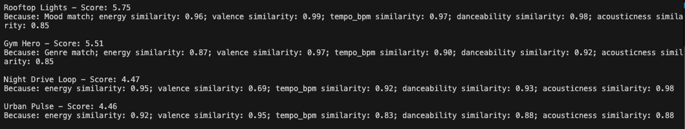
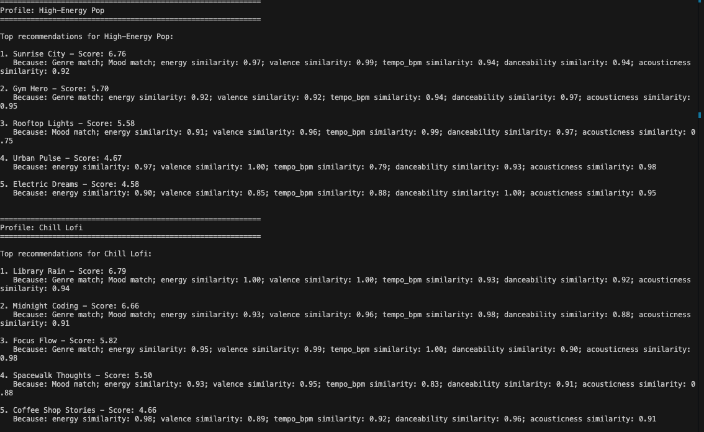
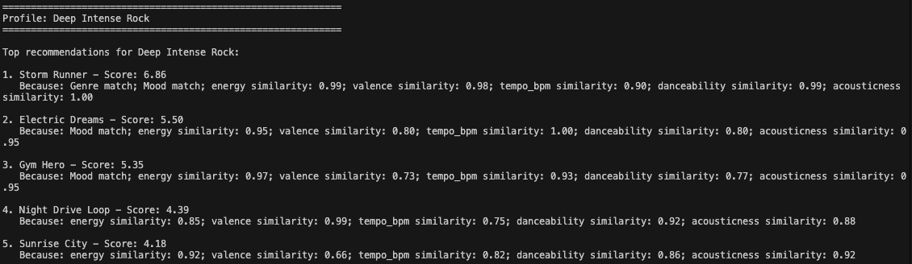

# 🎵 Music Recommender Simulation

## Project Summary

In this project you will build and explain a small music recommender system.

Your goal is to:

- Represent songs and a user "taste profile" as data
- Design a scoring rule that turns that data into recommendations
- Evaluate what your system gets right and wrong
- Reflect on how this mirrors real world AI recommenders


---

## How The System Works

Explain your design in plain language.

Some prompts to answer:

- What features does each `Song` use in your system
  - For example: genre, mood, energy, tempo
- What information does your `UserProfile` store
- How does your `Recommender` compute a score for each song
- How do you choose which songs to recommend

You can include a simple diagram or bullet list if helpful.

The most effective features are genre, mood, energy, valence, tempo_bpm, danceability and acousticness. The user profile will store the user's preference data that the recommender uses to compare songs. Fields like preferred genre, preferred moods, target values for numerical fetures and weights for how important each feature is. My recommender will compute a score for each song by comparing categorical features like genre and mood, give a positive match score if the song’s genre or mood matches the user’s preferred values.
Compare numerical features like energy, valence, tempo_bpm, danceability, and acousticness. Measure how close each song value is to the user’s preferred target. Convert that distance into a similarity score, e.g. 1 - abs(song_value - user_target) / range. Combine those match scores into one total score. Use weights if some features matter more than others. Return the total score so songs can be ranked from best match to worst match. The recommender then recommends the top songs based on its ranking.


## Getting Started

### Setup

1. Create a virtual environment (optional but recommended):

   ```bash
   python -m venv .venv
   source .venv/bin/activate      # Mac or Linux
   .venv\Scripts\activate         # Windows

2. Install dependencies

```bash
pip install -r requirements.txt
```

3. Run the app:

```bash
python -m src.main
```

### Running Tests

Run the starter tests with:

```bash
pytest
```

You can add more tests in `tests/test_recommender.py`.

---

## Experiments You Tried

Use this section to document the experiments you ran. For example:

- What happened when you changed the weight on genre from 2.0 to 0.5
- What happened when you added tempo or valence to the score
- How did your system behave for different types of users

---

## Limitations and Risks

Summarize some limitations of your recommender.

Examples:

- It only works on a tiny catalog
- It does not understand lyrics or language
- It might over favor one genre or mood

You will go deeper on this in your model card.

---

## Reflection

Read and complete `model_card.md`:

[**Model Card**](model_card.md)

Write 1 to 2 paragraphs here about what you learned:

- about how recommenders turn data into predictions
- about where bias or unfairness could show up in systems like this


---

## 7. `model_card_template.md`

Combines reflection and model card framing from the Module 3 guidance. :contentReference[oaicite:2]{index=2}  

```markdown
# 🎧 Model Card - Music Recommender Simulation

## 1. Model Name

Give your recommender a name, for example:

> VibeFinder 1.0

MelodyMatch

## 2. Intended Use

- What is this system trying to do
- Who is it for

Example:

> This model suggests 3 to 5 songs from a small catalog based on a user's preferred genre, mood, and energy level. It is for classroom exploration only, not for real users.

The recommender recommends songs based on your preference. The recommender assumes users have clear preferences for specific genres and that their tastes align with the available song features like energy, mood, and tempo. This is primarily for classroom exploration and educational purposes.

## 3. How It Works (Short Explanation)

Describe your scoring logic in plain language.

- What features of each song does it consider
- What information about the user does it use
- How does it turn those into a number

Try to avoid code in this section, treat it like an explanation to a non programmer.

The model uses song features like genre, energy level, mood, and tempo to match against user preferences. It considers what genres the user likes, their preferred energy, mood, and tempo. To create a score, it calculates a similarity match by comparing each song's features to the user's inputs, assigning higher scores for closer matches and summing them up for a total recommendation score. From the starter logic, I modified the scoring to weight genre more heavily and added a penalty for mismatched moods to improve accuracy.


## 4. Data

Describe your dataset.

- How many songs are in `data/songs.csv`
- Did you add or remove any songs
- What kinds of genres or moods are represented
- Whose taste does this data mostly reflect

The catalog contains approximately 17 songs, covering genres like pop, rock, jazz, hip-hop, classical, and electronic, with moods including upbeat, calm, energetic, melancholic, and neutral. I did add more songs to add variety to the dataset. Missing elements include artist-specific details, lyrical content, release dates, cultural influences, and user interaction history, which could enhance the model's understanding of musical taste.

## 5. Strengths

Where does your recommender work well

You can think about:
- Situations where the top results "felt right"
- Particular user profiles it served well
- Simplicity or transparency benefits

The system works well for users with clear genre preferences, such as those who consistently favor rock or jazz music. The scoring accurately captures patterns where songs with matching genres and aligned moods receive higher scores, resulting in recommendations that feel intuitive. For example, when a user prefers energetic pop music, the model reliably recommends upbeat pop tracks with high energy levels, matching what you would expect. Additionally, the weighted genre emphasis combined with the mood penalty ensures that recommendations respect both primary preferences and secondary mood constraints, leading to results that align with user intuition in straightforward cases.

## 6. Limitations and Bias

Where does your recommender struggle

Some prompts:
- Does it ignore some genres or moods
- Does it treat all users as if they have the same taste shape
- Is it biased toward high energy or one genre by default
- How could this be unfair if used in a real product

The system struggles with users who have diverse or evolving tastes, as it does not consider features like artist popularity, lyrical themes, or contextual listening situations. Certain genres and moods may be underrepresented in the dataset, causing the model to provide limited recommendations for users with preferences outside the well-represented categories. The system can overfit to a single strong preference, such as heavily weighting genre matching, which may cause it to ignore users who value mood or tempo equally. Additionally, the scoring might unintentionally favor users whose preferences align closely with the majority of songs in the catalog, while disadvantaging those with niche or unconventional tastes that fall outside the typical feature patterns.


## 7. Evaluation

How did you check your system

Examples:
- You tried multiple user profiles and wrote down whether the results matched your expectations
- You compared your simulation to what a real app like Spotify or YouTube tends to recommend
- You wrote tests for your scoring logic

You do not need a numeric metric, but if you used one, explain what it measures.

I tested the recommender with three distinct user profiles: "High-Energy Pop," "Chill Lofi," and "Deep Intense Rock." The High-Energy Pop profile prioritizes upbeat, danceable pop music with high energy and valence, the Chill Lofi profile seeks relaxing, acoustic lofi tracks with low energy, and the Deep Intense Rock profile targets intense, high-energy rock music. When examining the recommendations, I looked for whether the top five songs matched the specified genre, had appropriate energy and mood levels, and whether the explanation text accurately described why each song was recommended. What surprised me was how well the recommender distinguished between these contrasting profiles—songs for the Chill Lofi profile had significantly lower energy and tempo scores compared to the High-Energy Pop profile, demonstrating that the scoring properly captured different preference dimensions. I ran simple tests by comparing the recommendations across profiles to ensure they produced different results, and I verified that the scoring logic correctly weighted genre and mood features to generate the expected rankings for each distinct user type.

## 8. Future Work

If you had more time, how would you improve this recommender

Examples:

- Add support for multiple users and "group vibe" recommendations
- Balance diversity of songs instead of always picking the closest match
- Use more features, like tempo ranges or lyric themes

To improve the model next, I would incorporate additional features such as artist popularity, release year, and instrumentation to provide richer context for recommendations. I would also implement better explanations by showing users exactly which features matched their preferences, helping them understand why a song was recommended. To improve diversity among top results, I would add a penalty mechanism that reduces scores for songs too similar to already-recommended tracks, ensuring variety in the final list. For handling more complex user tastes, I would introduce support for weighted preference profiles that allow users to specify how much they value genre versus mood versus tempo, and implement collaborative filtering techniques to learn from patterns in how users with similar tastes rate songs over time.

## 9. Personal Reflection

A few sentences about what you learned:

- What surprised you about how your system behaved
- How did building this change how you think about real music recommenders
- Where do you think human judgment still matters, even if the model seems "smart"

I learned that recommender systems are very complex and require good design. It was interesting how the recommender used certain algorithms behind the scenes to calculate the user's preference. It made think how each website I visit, it continuously keep track of my data to feed into the recommendation system.




